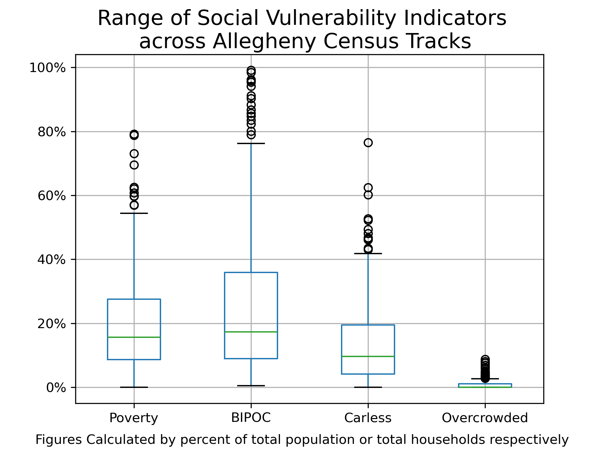
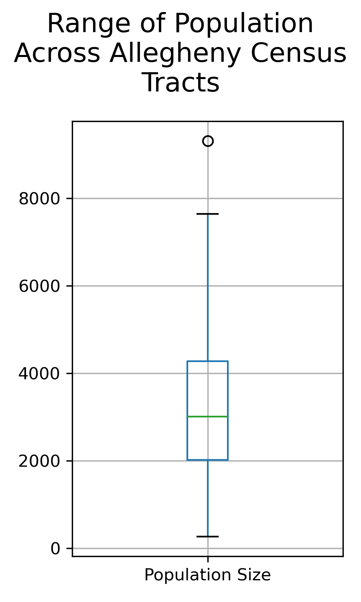
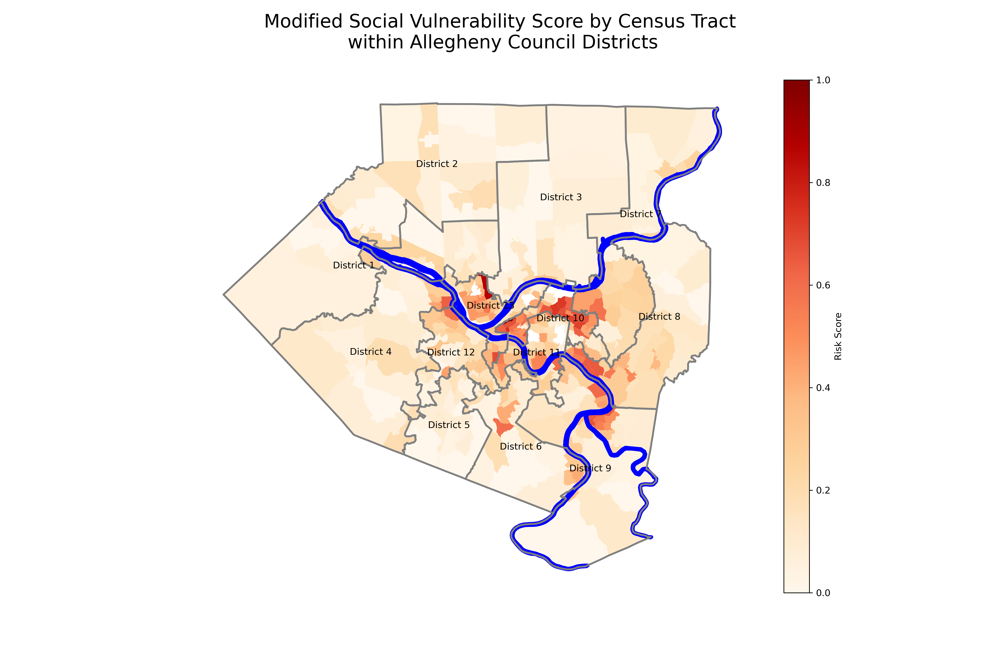
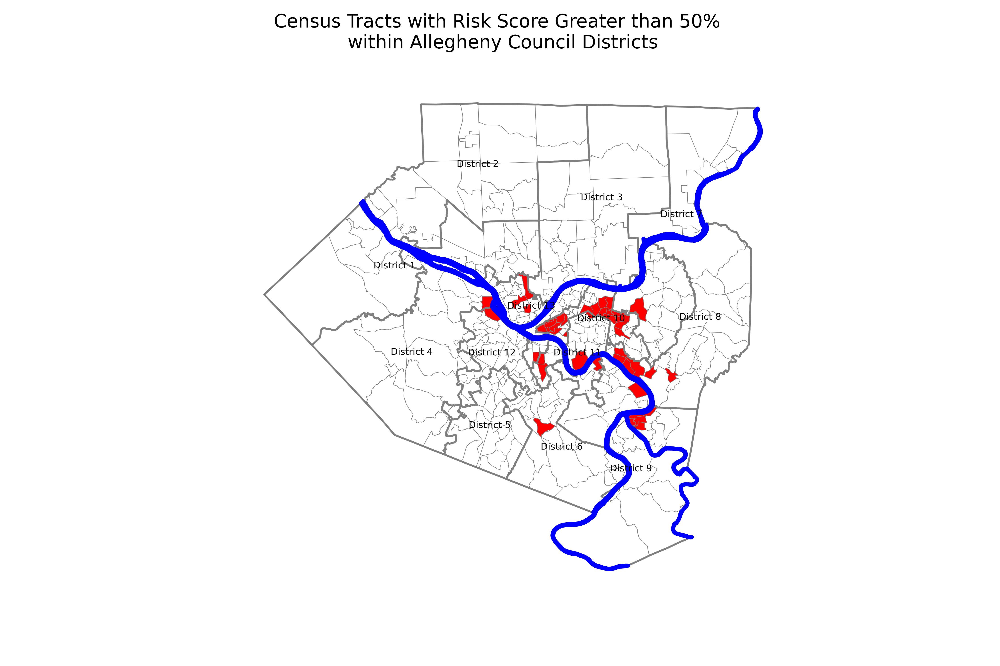

# I-Team Pittsburgh Interview exercise

In 2026 I applied for the I-team Analytics Manager for the city of Pittsburgh. I-teams are funded by the Bloomberg Foundation and staffing is managed by John Hopkins University. I-team stands for "innovation team." The initiative partners with city governments around the world to foster innovation and data-driven initiatives. 

A key part of the interview process is a case study analysis. You are given a handful of census tract level estimates and asked to analyze and your county and provide policy recommentations. In the assignment they mention these columns are used in the Social Vulnerably Index. Figuring the name-drop in the description was not by accident, I replicated the SVI calculation methods on this variable subset. 

Final variables included and caluclated:
 - % of population below the 150% poverty level
 - % of the population is BIPOC
 - % of households without a car
 - % of households with overcrowding
 - Normalized Risk Score

### Distribution of variables across Allegheny County

### Highest Risk Score Tract Values
| Population Size | % Poverty | % BIPOC | % Carless | % Overcrowded | Risk Score |
| ----- | ----- | ----- | ----- | ----- | ----- |
| 1,380 | 73.04% | 99.13% | 76.56% | 2.40% | 100.00% |
| 2,996 | 59.78% | 67.22% | 33.67% | 8.80% | 87.74% |
| 458 | 78.82% | 82.31% | 48.10% | 0.00% | 75.10% |
| 1,574 | 50.44% | 85.71% | 43.12% | 2.90% | 73.15% |
| 2,093 | 44.96% | 98.42% | 31.75% | 3.50% | 72.74% |
| 2,177 | 62.61% | 94.17% | 40.94% | 0.00% | 71.07% |
| 1,951 | 54.43% | 88.36% | 38.27% | 2.10% | 70.80% |
| 4,188 | 44.03% | 59.50% | 30.74% | 6.10% | 68.72% |
| 1,561 | 41.26% | 95.45% | 52.26% | 0.00% | 67.34% |
| 3,505 | 51.36% | 91.18% | 41.44% | 0.00% | 66.92% |

### Analysis

  
  

<!-- 

 -->